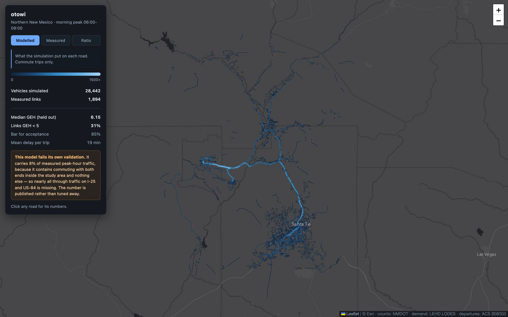
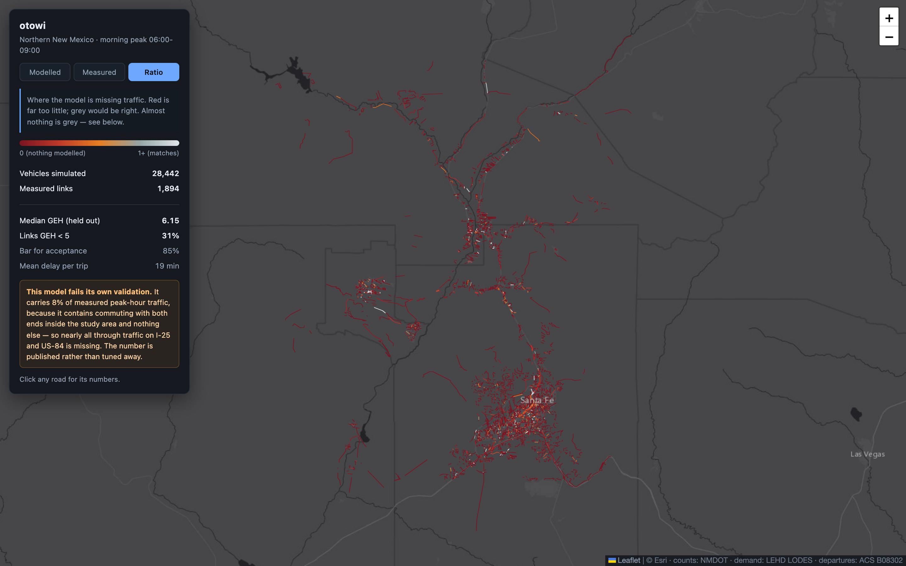

# otowi

[](https://github.com/deknapp/otowi/actions/workflows/tests.yml)

Traffic simulation for northern New Mexico: Santa Fe, the Los Alamos commute
over Otowi Bridge, and US-84 north to Abiquiu Lake.

Named for the bridge. NM-502 crosses the Rio Grande at Otowi and climbs to the
mesa, and there is no redundant route — which is why a small change in demand
produces a large change in delay, and why the commute is worth simulating
rather than estimating.

> **Status: it runs end to end, it is validated against real counts, and it
> fails them.** `otowi run --window 0 24` goes from an empty checkout to a
> converged 24-hour model compared against 2,567 NMDOT-measured links. On
> held-out segments **the model carries 14% of measured daily volume**. That
> number is reported rather than tuned away, because it is not a tuning error —
> see [What the calibration says](#what-the-calibration-says).
>
> It used to say 16%. That figure was inflated: trip generation placed every
> commuter's whole-day vehicle inside the 06:00–09:00 window, when 70.5% of
> measured departures happen then. The correction is in the numbers below.



*`otowi web` — the bright corridor is US-84/285 north out of Santa Fe,
branching west over Otowi Bridge to Los Alamos. Both map images on this page
were captured from an earlier run and are out of date; `otowi web` regenerates
them from the current one.*

## What it is for

Two questions, one model:

1. **The Los Alamos commute.** Roughly the same population drives the same
   corridor at the same time every weekday into a destination with clustered
   start times and one river crossing. That is a textbook tidal-flow problem
   with a hard bottleneck, and it is the daily reality for thousands of people.
2. **Getting across Santa Fe.** Cerrillos, St. Francis, Old Pecos Trail,
   St. Michael's. Less dramatic, more useful: when to leave, and which way.

## The part that matters

Most traffic simulations built outside of transportation agencies are a road
network from OpenStreetMap plus randomly generated trips. They animate
beautifully and mean nothing, because the demand is invented.

The demand here is not invented, and the model is not trusted on its own word:

- **Who commutes where comes from [LODES](https://lehd.ces.census.gov/data/)**
  — the Census Bureau's Longitudinal Employer-Household Dynamics Origin-Destination Employment Statistics (LODES8, 2022 vintage) — census-block-level counts of where workers live and
  where they work, built from unemployment-insurance wage records covering
  roughly 95% of private employment. LODES lags by a couple of years, so this
  is not a current-conditions model and the provenance says which year it is.
- **What time they leave comes from the American Community Survey**, [table B08302](https://data.census.gov/table/ACSDT5Y2022.B08302) — the question asking what time people usually left home for work. LODES has no
  time in it at all, and a fabricated departure curve would move every
  congestion number while looking entirely plausible.
- **Ground truth comes from the New Mexico Department of Transportation's published traffic counts.** Their
  [AADT layer](https://services.arcgis.com/hOpd7wfnKm16p9D9/arcgis/rest/services/Annual_Average_Daily_Traffic_2026/FeatureServer)
  gives the annual average daily traffic (AADT) on each highway segment, plus the two factors needed to turn a daily total into one direction of the busiest hour — 7,149 segments
  intersect the study area, with 2025 counts. It is open, and no key or request
  form is needed, despite the Data Management Bureau's page offering only an
  emailed PDF request form.
  The 17 permanent counting stations run by the [Santa Fe Metropolitan Planning Organization](https://santafempo.org/resources/traffic-counts/) are **not** wired in yet; they would add in-town coverage
  where NMDOT's state-highway focus is thinnest.
- **Validation is against held-out stations.** The model is fit on some of them
  and its error is reported on the rest. A simulation that reports its own
  error against ground truth it did not see is a different object from one that
  simply runs.

## Running it

```bash
python -m venv .venv && source .venv/bin/activate
pip install -e '.[fast,dev]'
```

That installs the SUMO toolchain from PyPI — `netconvert`, `duarouter` and
`sumo` land in `.venv/bin`, so there is no Homebrew tap to trust and no
XQuartz needed for the command-line tools.

Then, in order. Each stage writes to `data/cache/` and is skipped if its output
is already there, so re-running is cheap.

```bash
otowi places      # the study area and corridors — checks nothing has to download
otowi network     # OpenStreetMap → SUMO network        (~5 min, once, ever)
otowi demand      # LODES + ACS, reported without simulating   (~1 min)
otowi trips       # commute flows → individual vehicles         (~30 s)
otowi route       # duarouter: trips → paths                    (~30 s)
otowi simulate    # SUMO: the microscopic run                   (~5 min)
otowi calibrate   # compare against NMDOT counts                (~1 min)
otowi risk        # fatal crashes per unit of travel, per road   (~1 min)
otowi crashes     # the state's whole crash file, by hour        (~1 min first run)
otowi web         # interactive map on localhost                (instant)

otowi run         # all of the above, skipping what is done
```

`otowi network` is the slow one and it hits Overpass, a donated service. It
happens once; the extract is cached forever.

### What a run currently produces

On the whole day (`--window 0 24`), LODES 2022:

| | |
|---|---|
| Census blocks in the study area | 5,372 |
| Commute pairs touching it | 85,717 (39,697 internal) |
| Workers on those pairs | 99,580 |
| Blocks attached to a routable road | 4,953 (92.2%, median 95 m) |
| Vehicles generated | 107,901 (53,952 to work, 53,949 home) |
| Trips lost in routing | 0 |
| Assignment | converged at round 9 of 9 |
| Jam teleports | 166 |

Every vehicle appears twice because every commuter drives home. LODES measures
home-to-work flows and nothing else, so a model built from it alone has a
morning peak and fifteen empty hours; see
[the drive home](#the-drive-home-is-an-assumption).

Useful flags:

- `--scale 0.1` runs a tenth of the demand. Much faster, and **it does not
  reproduce congestion** — delay is not linear in demand, which is the whole
  reason this corridor is worth simulating. Use it for development, never for
  a result.
- `--window 0 24` runs a whole day; `--window 15 18` the afternoon peak. Any
  window works, and trips are kept or dropped by whether their departure falls
  inside it rather than by squeezing the day into it.
- `--seed N` — trip generation is Poisson, so a different seed is a different
  morning.
- `--end-padding N` — seconds to keep simulating after the last departure.

## A note on the jargon

Road engineering runs on abbreviations. The ones that survive in this README
are explained where they first appear, and the map and dashboard avoid them
entirely — a person checking their commute should not have to learn a
vocabulary first.

| | |
|---|---|
| **AADT** | Annual average daily traffic: how many vehicles use a road on a typical day, both directions. The basic unit of a traffic count. |
| **GEH** | Not an acronym — the initials of Geoffrey E. Havers. A goodness-of-fit score for comparing a modelled traffic volume against a counted one; under 5 is a good match on one road, and 85% of roads under 5 is the usual bar for accepting a model. |
| **LODES** | The Census Bureau's record of how many people commute between each pair of census blocks, built from unemployment-insurance wage records. |
| **FARS** | NHTSA's Fatality Analysis Reporting System: a census of every crash on a US public road that killed someone within 30 days. |
| **TRU** | UNM's Traffic Research Unit, which publishes NMDOT's full crash file — every severity, not only the fatal ones — as a report per county and per town. |
| **SUMO** | Simulation of Urban MObility, the open-source traffic simulator this is built on. |
| **K and D factors** | Published alongside a traffic count: K is the share of a day's traffic in its busiest hour, D the share of that hour going the busier way. |

## Where people have actually been killed

Everything else here models what *would* happen. `otowi risk`, and the **Risk**
tab on the map, report what did: every fatal crash NHTSA's
[FARS](https://www.nhtsa.gov/research-data/fatality-analysis-reporting-system-fars)
recorded inside the study area — a census, not a sample, of every crash on a US
public road that killed someone within thirty days, with a coordinate for each.

**A crash count is not a risk.** US-84 has more fatal crashes than almost any
road in the study area, and it is also the road the most people drive. Ranking
roads by crash count ranks them by how busy they are, which everybody already
knows. The number worth having is deaths per unit of *travel*, and the hard part
is the denominator — which is why this belongs in a traffic model rather than a
spreadsheet.

    road      deaths     km  veh/day  per bn veh-km  measured
    NM-68          3   15.5     5551      15.9 (5.8)      68%
    I-25           6   30.9    14707       6.0 (3.2)     100%
    NM-14          2   15.4     5686      10.4 (2.8)      84%
    US-84          4   24.9    11828       6.2 (2.7)      90%
    NM-599         2    9.5     9624      10.0 (2.6)     100%
    NM-502         1    6.5    27830       2.5 (0.2)      31%

NM-68 through the gorge is the worst road here and NM-502 over Otowi Bridge is
the safest, which is worth noting given that NM-502 is the corridor this whole
project is named for. The US average is about 7.

Three things about that table are the point:

**The bracketed figure is a Poisson lower bound, and it is the one to rank on.**
Three deaths and thirty deaths are not equally good evidence of a rate. Sorting
on the point estimate puts whichever quiet road had one bad night at the top,
which is how safety rankings usually go wrong.

**`measured` is the share of the exposure that came from a traffic count**
rather than from this model. A safety number resting on a count is a different
object from one resting on a simulation's opinion, and the model carries 14% of
real volume — so where a count exists it is used, and where one does not the
modelled volume is scaled by the calibration ratio and the column says so.

**Only 12% of the deaths are on roads that can be ranked at all.** 161 people
died in 147 crashes here between 2018 and 2023; 20 of those deaths were on
corridors NMDOT counts, which is what a rate needs. The rest are drawn on the
map as points and deliberately left unranked, because there is nothing honest
to rank them by. 45% of all of them happened after dark.

### When, which turns out to matter more than where

"When do crashes happen" and "when is driving dangerous" are different
questions, and only the second is useful — most crashes happen when most people
are driving, which is a fact about traffic. Dividing deaths per hour by *travel*
per hour turns it into a fact about risk, and the answer is not what a commuter
expects:

    03:00  4.76x an ordinary hour   ######################################
    08:00  0.25x                    ##
    21:00  2.51x                    ####################

**A kilometre driven at 3am is somewhere between ten and nineteen times more
likely to kill someone than a kilometre driven at 8am.** The rush hour is the
safest time to be on these roads, not the worst.

The range is there because the denominator is not measured. Nobody counts
traffic by hour on every road, so the model supplies that curve — and the model
contains commuting and nothing else, which overstates how much of the day's
driving happens at 08:00. That bias runs the same way as the result, so it has
to be bounded rather than mentioned.

The state's all-severity crash file is the second opinion (see below). Using
its hourly crash counts as a stand-in for exposure — *quasi-induced exposure*,
an old idea with an assumption that is wrong in a known direction — gives
**10x**, against the model's 19x. Both proxies fail, in opposite directions:
the model overstates the peak, and crashes-as-exposure drags every hour toward
1.0 because the thing being measured is inside the divisor. The worst hour is
03:00 on both, and the shape is the same on both. The size sits between them.

What does *not* survive the second opinion is the midday bump: 2.7x on the
model's curve, 0.9x on the crash curve. That one was the demand model's noon
hole, not a fact about the road.

### A quarter of the people killed here were not in a car

40 of the 161 deaths were people on foot or on a bike — **26% of all fatal
crashes**, and they are not on the highways. **64% of them died after dark**,
against 38% of the people killed inside vehicles. The single worst road for it
is Cerrillos Road, with ten.

That is a different problem from the rest of this page, with different fixes: a
rollover on a rural highway is about speed and geometry, and somebody killed
crossing a city arterial at night is about lighting, crossings, and a road built
too wide. Averaging the two describes neither, so they are counted separately
and drawn in a different colour. It is also the one finding here that no
per-kilometre corridor rate would ever surface, because the people it describes
were not driving.

**What the unit of analysis had to be.** Per SUMO edge — a couple of hundred
metres — every road in the study area returns exactly one crash at 300 to 800
deaths per billion vehicle-kilometres. That is not a finding, it is circularity:
the exposure denominator has been chosen by looking at where the numerator is.
Per OSM street name is not much better, since most edges here are unnamed and
the highways carrying the deaths are among them. NMDOT's route identifiers are
the unit, they arrive free with the count segments already matched for
calibration, and they were chosen without reference to where anybody died.

### The state records 136 crashes for every one FARS sees

FARS is a census of deaths and nothing else. New Mexico keeps a second file —
every police Uniform Crash Report, meaning any incident on a public road with a
death, an injury, or $500 of damage — and UNM's Traffic Research Unit publishes
it back as a per-community report under NMDOT contract. For the three counties
here that is **59,849 crashes over 2007–2021**, of which 439 were fatal.

Most of what it says needs no exposure denominator at all, which is what makes
it worth having next to a simulation. "Is driving more dangerous at 3am" has to
divide by how much driving happened. "*Given that* a crash happened, was drink
involved" does not — whatever the exposure was, it is in the numerator and the
denominator alike and cancels. Nothing modelled, nothing assumed:

| hour | crashes | drink involved | someone hurt | pedestrian or cyclist, per 1,000 |
|---|---|---|---|---|
| 02:00 | 124 | **30%** | 31% | — |
| 08:00 | 875 | **1%** | 30% | 16 |
| 17:00 | 1,388 | 4% | 37% | 28 |
| 21:00 | 476 | 15% | 35% | **80** |

Three things fall out of that table.

**Drink is the whole of the night.** A fortyfold swing between 02:00 and 08:00,
measured on 15,000 crashes.

**Crashes at night are not worse crashes.** Whether anyone was hurt barely
moves — 28% to 37% across the entire day, with no night spike. So the answer to
*why* 3am is dangerous is not that the crashes are more severe; it is who is
driving. (At the injury-or-property-damage threshold, which is the one these
reports publish by hour. Death is a rarer threshold and could still behave
differently.)

**Pedestrians are a different curve, not a smaller one.** They are in 16 of
every 1,000 town crashes at 08:00 and 80 at 21:00 — 30% of them hit between
18:00 and 23:00. That is neither when drivers crash nor when the roads are
empty. It is when the light goes. A tool that hands a pedestrian the driver's
hourly curve tells them to walk at exactly the wrong time.

The reports are published per county and per municipality, and neither is the
bounding box — Rio Arriba County runs north to Chama. So only the *shape* of
these curves is used, never the level, and there are no coordinates on any of
these records: FARS still does all the per-road work. NMDOT crash data is
collected under 23 U.S.C. § 409 and may not be used as evidence in an action
for damages against a road authority.

    otowi crashes --window 0 24

## Built on

[Eclipse SUMO](https://eclipse.dev/sumo/) — microscopic, open source (EPL-2.0),
maintained by the German Aerospace Center. SUMO supplies the traffic model and
the network format. Everything specific to northern New Mexico — the study
area, the demand, the calibration, the reporting — lives in this repository.

## Study area

| | |
|---|---|
| **Santa Fe** | the southern anchor and the in-town network |
| **Pojoaque** | where Los Alamos traffic leaves US-84/285 onto NM-502 |
| **Otowi Bridge** | the Rio Grande crossing, then the climb to the mesa |
| **Los Alamos** | the destination that makes the morning peak tidal |
| **Española** | US-84/285 splits toward Abiquiu and Taos |
| **Abiquiu Lake** | weekend recreational demand — a different regime entirely |

Roughly 65 km east–west by 83 km north–south. Simulation is scoped to the
morning and afternoon peak windows rather than a full day: a 24-hour
microscopic run over this area is mostly empty and the questions worth asking
do not live in it.

## Honesty

Things this will say about itself, and keep saying:

- **A calibrated model is still a model.** It reproduces count-station volumes
  within a stated error. That is not the same as predicting your Tuesday.
- **LODES is commute flows, and not all traffic is commuting.** Recreational
  travel to Abiquiu, freight, and tourism are not in it, and where they matter
  they will be estimated separately and labelled as estimates.
- **Uncalibrated output is not a result.** Until the validation error is
  reported, this repository will say so at the top.
- **The calibration checks place, not time.** Count stations say whether the
  right number of vehicles is on a road; nothing says whether the right number
  is on it at 14:00. The state's crash file is the only check available, and
  it does not flatter: the model puts 14% of the day's driving in the 08:00
  hour where 6% of the crashes are, and 2% at noon where 7% are. Anything that
  divides by the hourly travel curve inherits that, which is why the 3am
  finding is published as a range.

## What the calibration says

`otowi calibrate` compares modelled edge volumes against NMDOT's published
AADT. 7,149 count segments intersect the study area; 4,775 match an edge; 2,567
of those carry modelled traffic to compare.

**Which AADT figure depends on the window, and it is not a detail.** A
peak-window run is scored against **daily traffic × K × D**, where K is the
share of a day's traffic falling in its busiest hour (about 9–15% here) and D
is the share of that hour travelling in the busier direction (55–75%). Both are
published alongside the count. A whole-day run is scored against **half the
daily total** — halved because the count is two-way and the split really is
close to even over a day, by conservation. That drops both K and D, which
are factors published *alongside* the count rather than the count itself, so a
24-hour model is checked against the measurement instead of something derived
from it.

On the held-out half of the segments — split by a hash of the station ID, so it
is the same split on every run and cannot be reshuffled until it flatters:

| | held out | the other half |
|---|---|---|
| Roads compared | 1,253 | 1,314 |
| **Share of real traffic explained** | **14.2%** | 13.9% |
| Median GEH | 16.14 | 16.45 |

The two columns agree to within a third of a percent, which is the least
interesting result here and the one most worth stating: nothing was fitted, so
there was nothing to overfit. The held-out half exists to make that checkable
rather than asserted.

**A word on GEH, since it is the one bit of jargon here that cannot be
expanded.** It is not an acronym — it is the initials of Geoffrey E. Havers,
who proposed it — and it is the goodness-of-fit statistic traffic engineers use
to compare a modelled traffic volume against a counted one. It behaves like a
chi-square: near zero is a match, and a model is conventionally accepted when
85% of its links score under 5. Everywhere a general reader is the audience —
the map, the dashboard — this project says "share of real traffic explained"
instead, which is the same news in words.

**And GEH does not mean what it usually means in that table, and the report
says so.** GEH is defined for hourly flows, and the conventional bar — 85% of links
under 5 — is calibrated for them. The statistic scales with the size of the
numbers: multiply modelled and observed by *k* and GEH scales by √*k*. Daily
volumes here are about eight times hourly ones, so the *same model* scores
roughly 2.9× worse on a daily basis without having changed. Printing "5.6% of
links under GEH 5" next to that bar would be a units error dressed as a failing
grade, so a whole-day comparison omits the figure and says why.

The way to get a number that can be read against the bar is to score the
morning out of the whole-day run, which `otowi calibrate` does automatically:

| scored on | links | median GEH | GEH < 5 | share of real traffic |
|---|---|---|---|---|
| this run, 06:00–09:00 slice | 1,108 | **5.93** | 35.6% | 0.130 |
| the previous morning-only model | 1,234 | 5.92 | 37.8% | 0.163 |
| this run, whole day | 1,253 | 16.14 | *n/a* | 0.142 |

Per-link accuracy is unchanged — 5.93 against 5.92 — while the model now covers
24 hours rather than three and carries an honest vehicle count instead of one
inflated 1.42× by placing every commuter in the morning peak. The lower ratio
is that correction showing up where it should. **It is still nowhere near the
85% bar.**



*The ratio layer. Red is where the model carries far less than NMDOT measured;
grey would be a match. Almost nothing is grey.*

**The 14% is the finding, and no constant will fix it.** The model contains
commuting and nothing else: no freight, no shopping, no school runs, no
tourism. Those are absent by construction, not by accident, and they are most
of what is on the road at 07:30 — and even more of it at 11:00.

The shortfall has only a shallow gradient in road size. On the busiest measured
links the median ratio is 0.171 and on the quietest it is 0.134; on the morning
slice, 0.183 against 0.126. A model missing *highway* traffic specifically
would look the other way round, and one missing local traffic would show a much
steeper slope than this.

The ordering by corridor is the useful part. I-25 sits at 0.126, because almost
everything on it is going to Albuquerque or beyond — past the study area rather
than into it. NM-14, a Santa Fe commuter road, is at 0.672. The model is
closest to reality exactly where the traffic is commuting and furthest where it
is through traffic, which is what a commute-only model should look like, and it
is a map of what to build next.

### What the model says about the commute

This is the question the project exists for, and until 2026-09-08 the model
could not answer it: the Santa Fe to Los Alamos trip came out at a median of
116 minutes for a 63 km drive that really takes about 45. The cause was not the
highway. LODES reports jobs by census block, the laboratory sits in a couple of
blocks, and each block was attached to exactly one edge -- so 6,080 of the
9,387 vehicles arriving in Los Alamos were delivered to 6th Street, a
residential street. It deadlocked and the queue propagated back down East Road
and Diamond Drive onto NM-502. Arrivals are now spread across the roads that
actually serve the site, weighted by capacity.

`otowi when santa_fe los_alamos --window 0 24`, on the converged assignment:

| leave | duration | | leave | duration |
|---|---|---|---|---|
| 00:00 | 36.3 min | | 12:00 | 38.6 min |
| 04:00 | 37.4 min | | 16:00 | 39.2 min |
| 08:00 | **41.5 min** | | 20:00 | 39.0 min |

**The spread is 5.2 minutes across a whole day.** That is the answer worth
having, and it is not the one a commute model is expected to give: on this
corridor, at this demand, when you leave barely matters. A tool that only ever
emitted a single recommended departure could not say that, which is why the
planner reports every option and the gap between best and worst rather than a
recommendation.

Treat the durations as optimistic — see the coverage figure above — and the
shape of the curve as the more trustworthy part.

### Asking about a time of day

The planner takes a range, so the question can be the one you actually have.
Someone working a hospital shift in Española and driving from Santa Fe does not
want to know about the morning peak:

```console
$ otowi when santa_fe espanola --window 0 24 --between 17:00 23:00

  leave 17:00   30.9 min   arrive 17:30
  leave 19:00   30.3 min   arrive 19:30
  leave 22:00   29.9 min   arrive 22:29

  Leave any time between 17:00 and 22:00 -- within 1.5 min of the best
  the model can tell apart.
  Spread: 1.0 min between best and worst
```

### Which makes the planner recommend a different time

Joining the two halves changes the answer. The journey time moves by a minute
or two across a whole day; the chance of being killed moves by a factor of
nineteen. So the recommendation is risk-led, and the minutes are the
tie-breaker rather than the other way round:

```console
$ otowi when santa_fe espanola --window 0 24 --between 17:00 23:00 --risk

  leave 17:00   30.9 min   0.8x   <- safest
  leave 19:00   30.3 min   1.1x
  leave 22:00   29.9 min   3.0x

  On the roads this drive uses, 6.2 people have died per billion km driven
  -- about average for this region. 78% of the drive is on roads with no
  traffic count and could not be assessed.

  Leave at 17:00. About 3.8 times safer per kilometre than leaving at 22:00,
  and it costs 1 min more driving.
```

**The fastest departure is consistently among the most dangerous**, which is
the whole point: an empty road is quick precisely because it is empty, and an
empty road at night is where people die. A planner that ranks departures on
minutes recommends exactly the wrong one — and on this network it does so while
saving under a minute.

The recommendation is a **band**, never a minute. This model carries a fraction
of real traffic, so every duration is optimistic; the shape survives that
better than the absolute numbers do, but not well enough to distinguish 06:15
from 06:30 when they differ by forty seconds. Claiming otherwise would be
inventing precision.

The whole 24-hour curve is computed once and shipped in `plans.json` — 96
departure times for each of 30 origin–destination pairs, 180 KB — so the
dashboard answers any range by slicing what is already in the browser. Nothing
is computed per visitor and nothing could be: a run of this model takes hours.

### The drive home is an assumption

LODES measures home-to-work flows and nothing else. Every vehicle it produces
is driving *to* work, so a 24-hour run built from it alone gives a morning peak
and fifteen empty hours. The return trip has to be generated, and no free
source crosses return time with an origin–destination pair — ACS publishes
departure time to work (B08302) and travel time to work (B08303), and nothing
at all about the way back.

So each vehicle's return departs a sampled **time away from home** after its
outbound departure: mean 9.6 h, sd 1.8 h, clipped to 4–14 h. Folding the
commute into that quantity is deliberate — one assumption instead of two, and
the outbound duration is a model output that is not known when trips are
generated.

**This is the largest unmeasured input in a whole-day run, and the timing of
the evening peak is almost entirely determined by it.** It lives in
`config.TIME_AWAY_*` as a constant that can be varied and reported as a
sensitivity, rather than buried in a function, because that is the only
defensible way to use a number nobody measured.

Two further limits on the evening specifically. ACS's departure bins are half
an hour wide through the morning and then 12:00–16:00 and 16:00–24:00 — four
and eight hours — so an evening departure is placed in roughly the right part
of the day and smeared flat within it. And the question asks what time you
*usually* leave in a typical week, which under-represents shift work by
construction. Both push the modelled evening toward being flatter than reality.

### Convergence

Assignment iterates until routes and travel times agree. Route shift is the
share of drivers who changed path since the previous round:

| round | unfinished | mean duration | mean delay | route shift | jam teleports |
|---|---|---|---|---|---|
| 1 | 11.2% | 63 min | 45 min | — | 17,218 |
| 2 | 0.0% | 41 min | 24 min | 42.3% | 6,209 |
| 3 | 0.0% | 24 min | 6 min | 21.9% | 752 |
| 5 | 0.0% | 22 min | 4 min | 8.9% | 223 |
| 7 | 0.0% | 21 min | 3 min | 6.4% | — |
| 9 | 0.0% | 21 min | 3 min | 5.3% | 166 |

Round 1 is single-pass free-flow routing — every driver handed the same
fastest-on-an-empty-road path — so it is the worst case by construction rather
than a result, and its 17,218 jam teleports are what that costs. The
assignment is the thing that removes them.

**Five rounds was not enough and the tool said so.** At round 5 route choice
had settled to 8.9% but mean time loss was still moving 6.4% between rounds,
and the run reported `Not converged`. Route choice settling while travel times
have not is not an equilibrium — it means drivers have stopped switching but
the network they are switching on is still changing under them. Nine rounds
gets both under the threshold: 5.3% and 1.9%.

A run whose route shift is still large, *or whose time loss is still moving*,
has not converged and its travel times are not worth quoting. The planner
refuses to be interesting about a model in that state, and it should.

### What is wrong with the current numbers, specifically

The pipeline runs and converges. These are the reasons to read its travel times
with care:

1. **The model carries 14% of measured volume**, for the structural reason
   above. A network loaded to a sixth of reality is a network with less
   competition for space than the real one, so every duration here is
   optimistic. This is the honest limit on the whole model and no amount of
   assignment fixes it.
2. **A small amount of deadlock remains.** The converged run needed 166 jam
   teleports — SUMO's rescue for a stuck vehicle — for 107,901 vehicles, down
   from 17,218 on the free-flow first round. Small enough not to distort the
   averages, not small enough to call the network right.
3. **The evening's shape rests on an assumption**, not a measurement. See
   [the drive home](#the-drive-home-is-an-assumption). The morning is measured;
   the evening is inferred from it.
4. **Every vehicle finishes**, which is worth stating because it did not
   always: `vehicles_unfinished` is reported rather than left to be inferred
   from a missing row, and unfinished trips bias travel times *downward*
   exactly where the network is worst.

Five bugs found by building this are worth recording, because every one of them
reported success while being wrong. That is the failure mode this project keeps
producing, and the reason so much of the code asserts its own output:

- **netconvert built 911 edges from 11,710 ways** and called it a success — no
  I-25, no US-84/285, no traffic lights — because the tile merge interleaved
  nodes and ways. Fixed; the network is now 31,909 usable edges.
- **duarouter silently discarded 30% of trips.** `--ignore-errors` turns an
  unroutable trip into a warning nobody reads, and the missing vehicles looked
  exactly like congestion. The cause was that only 22,782 of 31,909 edges are
  mutually reachable — a bounding box severs frontage roads and one-way stubs —
  and trips were being attached to fragments. Trip endpoints are now restricted
  to the largest strongly-connected component, and every run compares input
  trips against output routes so this cannot be silent again.
- **The morning peak was 1.42× too big.** The departure profile was
  renormalised to the simulation window while the vehicle count stayed a whole
  day's, so 100% of a flow's drivers departed between 06:00 and 09:00 when
  70.5% of measured departures do. No output could reveal it: the vehicle total
  was exactly the number it was meant to be, and the shape within the window
  was right. The window is now a filter over a whole-day profile.
- **The map drew a road that does not exist.** FR 289 Dome Road is a dirt
  Forest Service track over the Jemez, tagged `residential` with
  `surface=dirt`, one segment `4wd_only=yes` and another `access=private`.
  netconvert reads none of that, gave it a lane at 50 km/h, and the assignment
  found a Cochiti-to-Los Alamos shortcut of 55 km against the ~97 km the drive
  really takes — carrying 400 to 835 vehicles an hour over a washed-out track.
  It was the *only* path between the two in the network, because the road that
  actually serves Cochiti crosses the southern edge of the bounding box.
  Unsealed *and* restricted ways are now dropped; Cochiti drops out with them,
  which is the truth.
- **Return trips went the wrong way through gateways.** An entry gateway is an
  edge with no incoming edges, so nothing can arrive there; an exit gateway has
  no outgoing edges, so nothing placed on it can move. The drive home reused
  whichever gateway the outbound leg had chosen, and duarouter discarded a
  quarter of the demand without an error.
- **`otowi run` skipped the assignment whenever a routes file existed** — and
  `otowi route` writes the same filename as `otowi assign`. So running the
  single-pass router once by hand, for any reason, silently disarmed iterative
  assignment for every run afterwards: 26,495 teleports against 356, because
  every driver held the empty-network path. The check now asks whether an
  assignment *finished*, using the alternatives file that only the assignment
  writes.

## License

MIT
